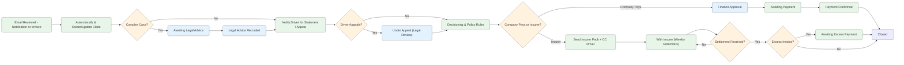

# DamageClaims

```mermaid
flowchart LR
  classDef auto fill:#E8F5E9,stroke:#777,rx:6,ry:6;
  classDef decision fill:#FFF3E0,stroke:#777;
  classDef human fill:#E3F2FD,stroke:#777,rx:6,ry:6;
  classDef data fill:#F3E5F5,stroke:#777;

  A["Email Received - Notification or Invoice"]:::auto --> B["Auto-classify & Create/Update Claim"]:::auto
  B --> C{Complex Case?}:::decision

  C -- Yes --> D["Awaiting Legal Advice"]:::human
  C -- No --> E["Notify Driver for Statement / Appeal"]:::auto

  D --> F["Legal Advice Recorded"]:::human --> E

  E --> G{Driver Appeals?}:::decision
  G -- Yes --> H["Under Appeal (Legal Review)"]:::human
  G -- No --> I["Decisioning & Policy Rules"]:::auto
  H --> I

  I --> J{Company Pays or Insurer?}:::decision
  J -- Company Pays --> K["Finance Approval"]:::human --> L["Awaiting Payment"]:::auto --> M["Payment Confirmed"]:::auto --> X["Closed"]
  J -- Insurer --> N["Send Insurer Pack + CC Driver"]:::auto --> O["With Insurer (Weekly Reminders)"]:::auto --> P{Settlement Received?}:::decision
  P -- No --> O
  P -- Yes --> Q{Excess Invoice?}:::decision
  Q -- Yes --> R["Awaiting Excess Payment"]:::auto --> X
  Q -- No --> X
```

